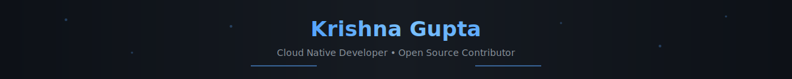

<div align="center">
  
  <br>
</div>

<p align="center">
  <a href="https://www.linkedin.com/in/krishna-gupta-a10ba6323/"></a>
  <a href="https://x.com/KG_CodeMode"></a>
  <a href="mailto:krishnagupta.kg2k6@gmail.com"></a>
</p>

<p align="center">
  <picture>
    <source media="(prefers-color-scheme: dark)" srcset="https://raw.githubusercontent.com/Krishna-kg732/Krishna-kg732/output/github-snake-dark.svg"/>
    <source media="(prefers-color-scheme: light)" srcset="https://raw.githubusercontent.com/Krishna-kg732/Krishna-kg732/output/github-snake.svg"/>
    
  </picture>
</p>

---

```go
// currently working on
package main

type CloudNativeDev struct {
    Project   string   `json:"cloudplane"`
    Stack     []string `json:"golang,kubernetes,aws"`
    Learning  []string `json:"distributed-systems,platform-engineering"`
    OpenTo    string   `json:"collaboration on cloud-native projects"`
    FunFact   string   `json:"I debug with fmt.Println 🐛"`
}
```

---

<div align="center">

### `Tech Stack`

**Languages & Runtime**


**Cloud & Infrastructure**


**Observability**


---

### `Metrics`


---

### `💭 Random Dev Quote`


---

<details>
<summary><b>🎯 Current Goals</b></summary>
<br/>

| Goal | Status |
|:-----|:------:|
| Contribute to CNCF projects | 🔄 |
| Build CloudPlane platform | 🔄 |
| Master distributed systems | 📚 |
| LFX Mentorship | 🎯 |

</details>

<details>
<summary><b>⚡ Quick Facts</b></summary>
<br/>

- 🔭 Building **CloudPlane** - a cloud-native platform
- 🌱 Deep diving into **Go** and **K8s internals**
- 👯 Looking to collaborate on **open source** projects
- 💬 Let's talk about **cloud architecture** & **DevOps**
- 🎮 When AFK: Gaming, Coffee, Repeat ☕

</details>

<details>
<summary><b>🏆 GitHub Trophies</b></summary>
<br/>


</details>

---

<sub>✨ Building the future, one commit at a time</sub>

<br/>


</div>
